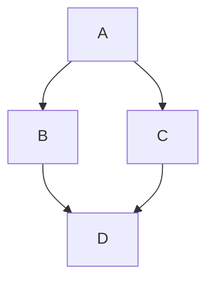

# riptide_control
Riptide Control serves as a package group for all onboard control packages for our AUV platform riptide. This repository includes the riptide_controllers package, the riptide_planners package and the riptide_teleop package.

|            |              |
|------------|--------------|
| OS Distro  | Ubuntu 22.04 |
| ROS Distro | ROS2 Humble  |

This is the intended data flow of the system.

## riptide_controllers
Riptide Controllers supports controlling an over acutated vehicle by first computing a feed forward and feed back forces in the body frame. The 6dof problem is then solved via force minimization across the 8 thrusters on our over-actuated vehicles. 

## riptide_teleop
Riptide Teleop supports both the keyboard teleop twist node as well as the standard ros joy node as control interfaces for commanding the vehicle while underway. This operation mode generally requires the vehicle to be tethered to an operator computer topside.

## riptide_planers
Riptide planners supports 6DOF path planning in 3D space. The current planner is able to generate a spline path based on Hermite Splines and quaternion SLERP (Spherical Linear intERPolation). The planner is intended to be accessed in the controller via a service call that can be made to request a trjectory from a set of waypoints. The trajectory will contain the following items: 
1. 6DOF position and orientation 
2. linear and angular velocity
3. linear and angular acceleration